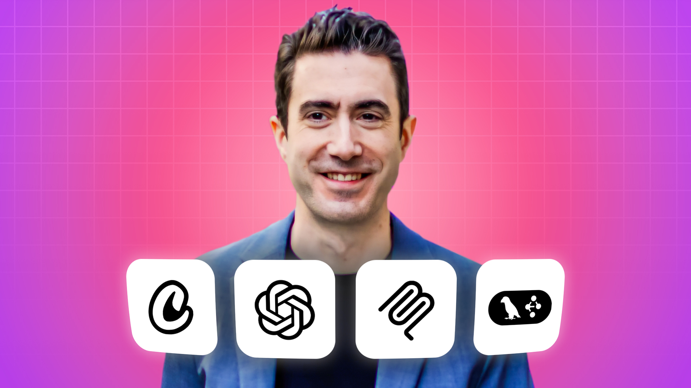

## Master AI Agentic Engineering -  build autonomous AI Agents

### 自律型AIエージェントをOpenAI Agents SDK、CrewAI、LangGraph、Google ADK、Pydantic AI、MCPでコーディング・デプロイする6週間の旅

_Cursorでこれを見ている場合は、左側のExplorerでファイル名を右クリックし、「Open preview」を選択すると、整形されたバージョンを表示できます。_

心から歓迎します!これは、Agentic AIというパワフルで驚異的、そしてしばしば非現実的にすら感じる世界への、あなたの6週間の冒険の始まりです。

### これは2026年夏にリフレッシュされたバージョンです

最新のツール、モデル、テクニックを反映して内容を完全に更新しました。よくある質問への回答:  
[アップグレードで何が変わったのか?](https://edwarddonner.com/avatar?q=67)  
[なぜアップグレードが行われたのか?](https://edwarddonner.com/avatar?q=65)  
[コースの途中だったが、コードをどうアップグレードすればいいか](https://edwarddonner.com/avatar?q=66)  

### 最も多い質問への回答

[私のCursorの見た目が違う(新しいスプラッシュ画面)](https://edwarddonner.com/avatar?q=54)  
[OpenAIの代わりにGeminiや無料モデルを使えますか? もちろん!](https://edwarddonner.com/avatar?q=8)  
[コースの資料はどこにありますか](https://edwarddonner.com/2025/04/21/the-complete-agentic-ai-engineering-course/)   
[このコースは他のコースとどう関連していますか?](https://edwarddonner.com/curriculum)  
[プログラミング未経験でもこのコースは受講できますか?](https://edwarddonner.com/avatar?q=2)  
[このコースを受講した後、どんな仕事に就けますか?](https://edwarddonner.com/avatar?q=3)  

### 始める前に

私はあなたが最も成功できるようにここにいます!プラットフォーム上でも、直接メール(ed@edwarddonner.com)でも、遠慮なく連絡してください。コミュニティを育てるために、LinkedInでつながるのも大歓迎です。私はこちらにいます:  
https://www.linkedin.com/in/eddonner/  

そして私のYouTubeチャンネルには、コースを補完する多くの動画があります。こちらです:  
https://youtube.com/@edward.donner

### 大して恐ろしくない、セットアップ手順

有名な最後の言葉になるかもしれませんが、それほどひどくないセットアップ環境を用意できたと本当に思っています!

- Windowsの方は、手順は[こちら](setup/SETUP-PC.md)
- Macの方は、[こちら](setup/SETUP-mac.md)
- Linuxの方は、[こちら](setup/SETUP-linux.md)

何か問題があれば、ぜひご連絡ください。

### とても役立つリソース

- 動画付きのコース[リソース](https://edwarddonner.com/2025/04/21/the-complete-agentic-ai-engineering-course/)
- [guides](guides/01_intro.ipynb)セクションにある多くの必須ガイド
- よくある質問すべてに答えられる私の[アバター](https://edwarddonner.com/avatar)

### APIコストについて - 必読!

このコースでは、OpenAIや他の最先端モデルへのAPI呼び出しを行うため、APIキーと少額の費用が必要です。これはSETUP手順の中で設定します。API呼び出しに費用をかけたくない場合は、DeepSeekのような安価な選択肢や、Ollamaのような無料の選択肢もあります!

詳細は[こちら](guides/09_ai_apis_and_ollama.ipynb)。

支出に完全に納得できるよう、APIコストは必ず監視してください。OpenAIのダッシュボードは[こちら](https://platform.openai.com/usage)です。

### 何より大切なこと -

コースを楽しんでください!Agentic AIについて学ぶのに、今以上に良い時期はありません。一分一秒すべてを楽しんでいただけることを願っています!どこかで詰まったら、[私に連絡してください](https://www.linkedin.com/in/eddonner/)。
